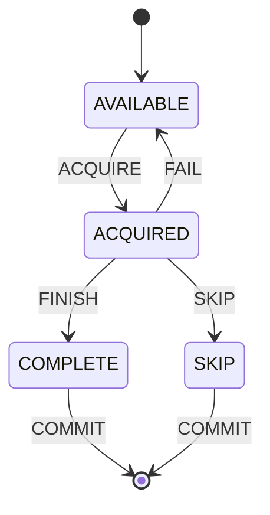

# DTM – A Distributed Task Manager, Done Right

DTM enables distributed, asynchronous task execution engines to ensure that a task is executed exactly once for a given time slot. The scenario that inspired this work was the need to query a potentially unreliable database and produce a report counting the number of values present for a time range with various groupings of the data to be consumed by other systems to trigger alerts and initiate reprocessing from archives to fill the gaps. In addition to this one time job, it may be desirable to allow other services to adjust the status of a completed task and mark it as available so that it will be processed again, perhaps due to the arrival of a significant volume of new data, bringing the fidelity of the previous result into doubt.

## High-Level Requirements
### Functional
1. Tasks are uniquely identified by a name and time. In practice, each application performing a task, such as computing the record count, will use the same task name every time it executes.
2. Tasks 

### Non-Functional
1. Tasks are completed exactly once. Ideally the same DB will also be used as the queue for the next stage of processing.
2. Designed for minimal maintenance and overhead.
3. Operates purely as a library–no server required.
4. No specialized distributed locking library required.
5. No defects related to 

1. Tasks are in one of four states:
    1. AVAILABLE
    2. ACQUIRED
    3. COMPLETE
    4. SKIP

When tasks are initially created, they are in the state available. After being acquired, a task that has failed will return to the available state, but may include a message indicating the reason for the failure. 

### State Transition Diagram


1. Use transactions
2. Use `SELECT FOR UPDATE NOWAIT` to acquire a lock on a row or have an error raised, avoiding race conditions. https://www.2ndquadrant.com/en/blog/what-is-select-skip-locked-for-in-postgresql-9-5/
3. Hold open transaction/connection for duration of work to ensure failures release the lock as a result of the TCP disconnect. https://martin.kleppmann.com/2016/02/08/how-to-do-distributed-locking.html


## Download
Latest version: 0.1.0

You can add this library into your Maven/Gradle/SBT/Leiningen project thanks to JitPack.io. Follow the instructions [here](https://jitpack.io/#lfeagan/distributed-task-manager).

### Example Gradle instructions

Add this into your build.gradle file:

```groovy
allprojects {
  repositories {
    maven { url 'https://jitpack.io' }
  }
}

dependencies {
  implementation 'com.github.lfeagan:distributed-task-manager:0.1.0'
}
```


