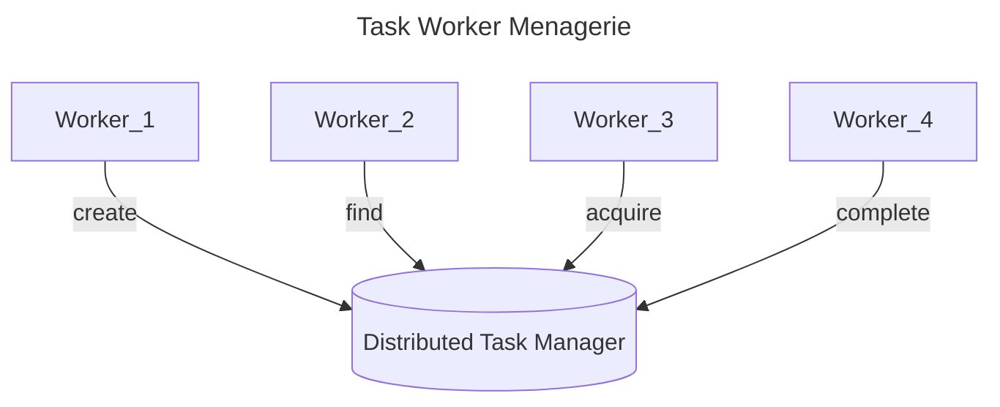
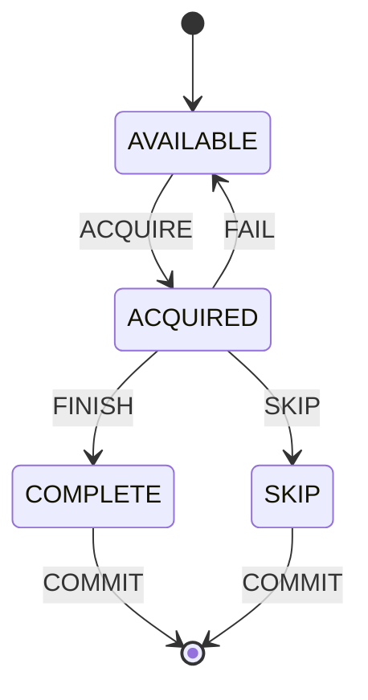

# Design

## High-Level Requirements
### Functional
1. Tasks are uniquely identified by a name and time. In practice, each application performing a task, such as computing the record count, will use the same task name every time it executes.
2. Tasks

### Non-Functional
1. Tasks are completed exactly once. Ideally the same DB will also be used as the queue for the next stage of processing.
2. Designed for minimal maintenance and overhead.
3. Operates purely as a library–no server required.
4. No specialized distributed locking library required.
5. Task lock(s) automatically release on unexpected task failure.

1. Tasks are in one of four states:
    1. AVAILABLE
    2. ACQUIRED
    3. COMPLETE
    4. SKIP

When tasks are initially created, they are in the state available. After being acquired, a task that has failed will return to the available state, but may include a message indicating the reason for the failure.

### State Transition Diagram

1. Use transactions
2. Use `SELECT FOR UPDATE NOWAIT` to acquire a lock on a row or have an error raised, avoiding race conditions. https://www.2ndquadrant.com/en/blog/what-is-select-skip-locked-for-in-postgresql-9-5/
3. Hold open transaction/connection for duration of work to ensure failures release the lock as a result of the TCP disconnect. https://martin.kleppmann.com/2016/02/08/how-to-do-distributed-locking.html
